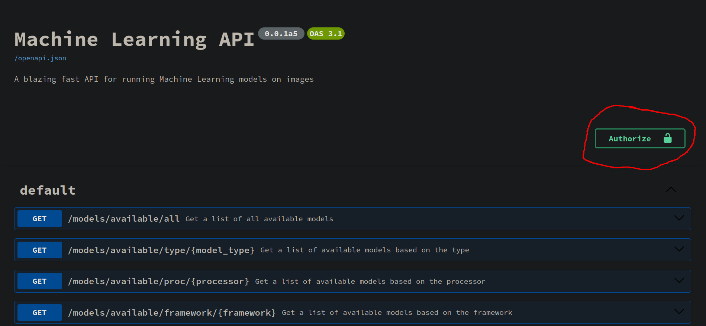

# ZoneMinder Machine Learning API (zomi-server)
>[!CAUTION]
> :warning: This software is in **ALPHA** stage, expect issues and incomplete, unoptimized, janky code ;) :warning:

This is a FastAPI (with uvicorn and pydantic V2) based server component for the new ZoneMinder ML add-on. Please see the 
[workflow docs](docs/workflow.md) for information on how the server processes inference requests. 
There is also rudimentary support for [color detection](docs/Config/color.md) of cropped bounding boxes.

# Supported ML backends and hardware
>[!NOTE]
> At the moment, only pretrained models are supported. Custom models are planned for the future (or you can open PR's!).

The server currently has basic support for several ML backends and hardware accelerators.

## ML backends
- OpenCV (DarkNet - YOLO version 3, 4, 7 - [5, 6] *WIP*) [[CUDA support](docs/hardware/opencv_cuda.md)]
- PyTorch - `torchvision` (CUDA supported, ROCm *WIP*)
- ONNXRuntime (YOLO v8, YOLO-NAS, [YOLO v10 *WIP*]) [CUDA supported, ROCm *WIP*]
- TensorRT (YOLO v8, YOLO-NAS, [YOLO v10 *WIP*]) [[compile trtexec locally]()]
- pycoral ([coral.ai Edge TPU](https://coral.ai/products))
- openalpr ([compile local binary](docs/hardware/openalpr.md))
- [face-recognition](https://github.com/ageitgey/face_recognition) based on [D-Lib](https://github.com/davisking/dlib) ([CUDA support](https://gist.github.com/baudneo/e68fd4a7e7975a15bc1be5c99f722fd0))
- HTTP
    - [platerecognizer.com](https://platerecognizer.com)
    - [AWS Rekognition](https://docs.aws.amazon.com/rekognition/latest/dg/what-is.html)
- *Open an issue or pull request to get a backend/api supported*

## Hardware
- CPU
    - OpenVINO is planned 
- Nvidia GPU (CUDA / cuDNN / [Tensor RT](docs/hardware/tensor_rt.md))
- AMD GPU (Pytorch/onnxruntime ROCm) *WIP / Untested*
- [Coral.ai Edge TPU](docs/hardware/coral.md)

See the [docs/hardware](docs/hardware) directory for more information on hardware support.

# Install
Please see the [installation docs](docs/install.md) for more information.

# Swagger UI
>[!TIP]
> Swagger UI is available at the server root: `http://<server>:<port>/`

The server uses FastAPIs built-in [Swagger UI](https://swagger.io/tools/swagger-ui/) which shows available endpoints, response/request schema and 
serves as self-explanatory documentation.

>[!WARNING] 
> Make sure to authorize first! All requests require a valid JWT token. 
> If you haven't enabled auth in the `server.yml` config file, any username:password combo will work.
>

# User authentication
>[!CAUTION]
> You can enable and disable authentication, but all requests must have a valid JWT token. When authentication is disabled,
> the login endpoint will accept any username:password combo and supply a valid usable token.

## Default user
The default user is `imoz` with the password `zomi`.

# User Management
User management is done using the `mlapi` script and the `user` sub-command. 
For more information, please see the [User Management](docs/user_management.md) docs.

# Start the server
>[!TIP]
>After installation, there should be a system-wide `mlapi` script command available in `/use/local/bin`

The server can be started with the `mlapi` script.
```bash
mlapi -C /path/to/config/file.yml
```

## Debugging
The server can be started in debug mode with the `--debug` or `-D` flag.
```bash
mlapi -C /path/to/config/file.yml --debug
```

# SystemD service
A SystemD service file example is provided in the [configs/systemd](configs/systemd/mlapi.service) directory.
```bash
sudo cp ./configs/systemd/mlapi.service /etc/systemd/system
sudo chmod 644 /etc/systemd/system/mlapi.service
sudo systemctl daemon-reload
# --now also starts the service while enabling it to run on boot
sudo systemctl enable mlapi.service --now
```

# Fail2Ban
A Fail2Ban filter and jail configuration example is provided in the [configs/fail2ban](configs/fail2ban) directory.

# logrotate
A logrotate configuration file example is provided in the [configs/logrotate](configs/logrotate) directory.

# Docker
Work is being done to create Docker images for the server.